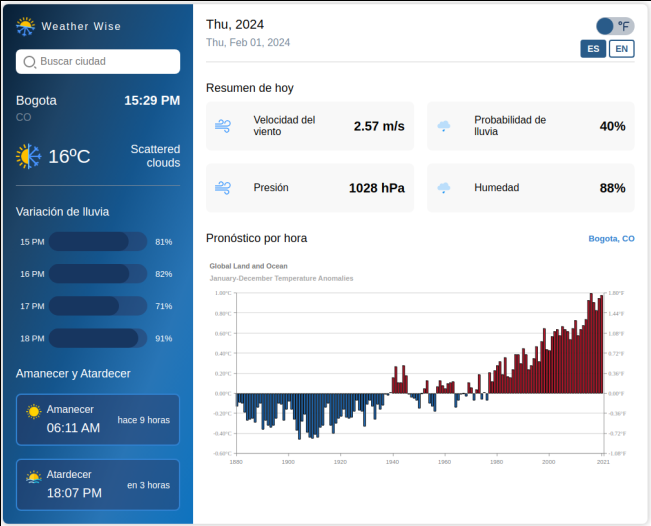

<h1 align="center"><em>WeatherWise</em></h1>
</img>

   
   
   
   
   
   
   
   

<h2>Introducción</h2>

WeatherWise es una app del clima que inicialmente mostrará un estado de carga, mientras verifica si en el Local Storage existe o no información guardada previamente. De no ser asi, accede a la ubicación del usuario para poder mostrar los detalles climatológicos de su ciudad. El usuario podrá cambiar las unidades métricas de temperatura a través de un Switch (en un principio, será mostrada en ºC), así como también, el idioma de la aplicación (español, por defecto) haciendo uso de dos botones ("ES", "EN"). Se mostrará un mensaje de advertencia, en caso, de que la información ingresada por el usuario no coincida con una ciudad, o que no cumpla con la cantidad mínima de habitantes (ciudad: ​a partir de 50.000 habitantes). Los datos de la ciudad ingresada por el usuario, serán almecenados en el localStorage para la persistencia de datos.

Inicialmente verá un input en el que debe ingresar una ciudad, éste input cuenta con un <em>debounce</em> que espera 1 seg antes de hacer la consulta a la API.

En la sección de barras de "Variación de lluvia, y la card de "Probabilidad de lluvia", se implementó la función Math.random(), ya qué no eran datos enviados por la API; así como también, la imagen de gráfica de temperatura.

<h3>WeatherWise cuenta con distintas funcionalides y características:</h3>

<ul>
  <li> Es mobile first.</li>
  <li> Estado de carga (Loading Skeleton e input loader).</li>
  <li> Consultas a una API.</li>
  <li> Cambio de unidades métricas.</li>
  <li> Traducciones.</li>
</ul>

https://github.com/genepatino/weather_wise/assets/62777013/e739b0ae-4380-4859-a2db-0825659ebc88

<em>Gracias por mirar🌸</em>

<h3>Créditos por diseño a:</h3>
Syahrul Falah, Tegal Indonesia

<h3>Autora:</h3>
Génesis Patiño

</img>
